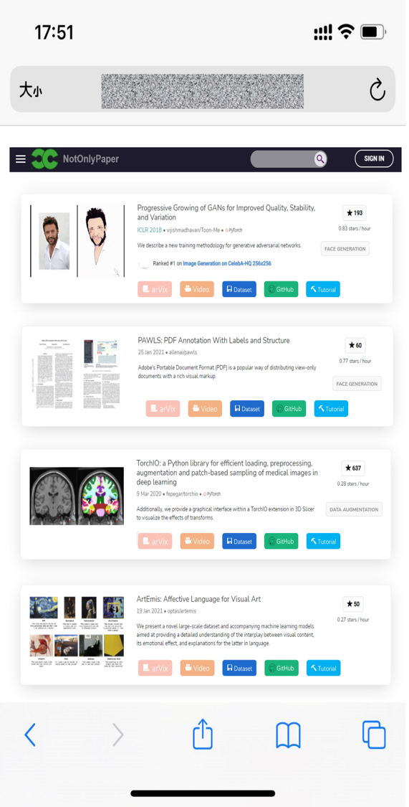
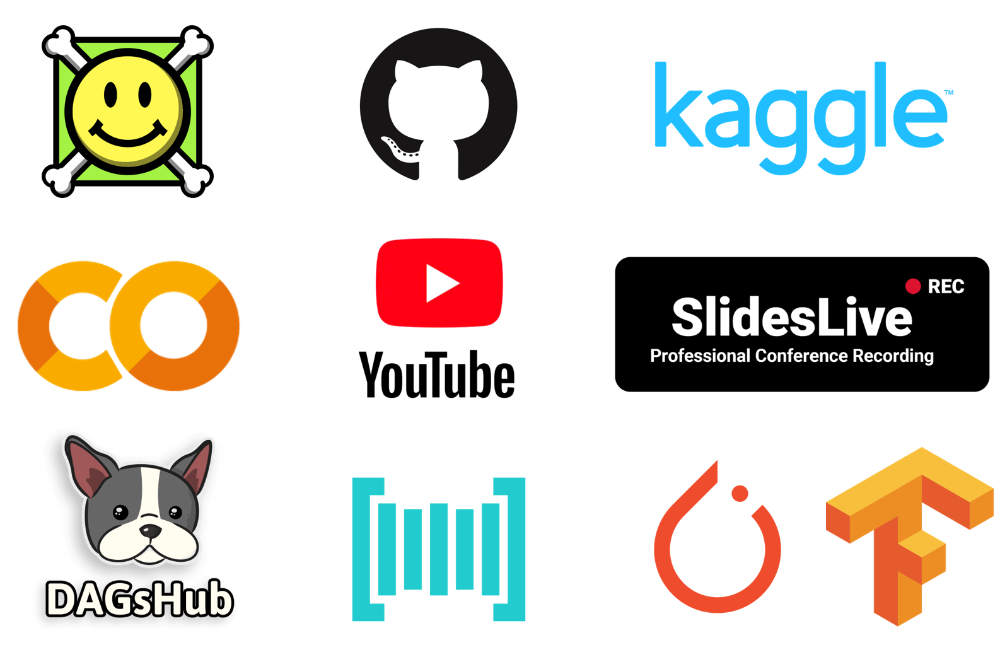

    

# NotOnlyPaper
PaperEasy = <b>arXiv</b> + <b>code</b> + <b>video</b> + <b>tutorial</b> + <b>Colab/demo</b>

&nbsp;&nbsp;&nbsp;&nbsp;&nbsp;&nbsp;

 

   

## Features

- paper with code

- [papers with video](https://github.com/amitness/papers-with-video)

- dataset https://dagshub.com/  https://www.paperswithcode.com/datasets

- [open in colab](https://github.com/googlecolab/open_in_colab)

- related work

- cross platform

   

<h5>demo in mobile phone</h5>

## Usage

### Open In Colab Chrome Extension

To install the extension directly from source:

1.  Clone this repository to your local disk.
2.  Open the Chrome browser, and navigate to chrome://extensions.
3.  Ensure that developer mode is enabled (see the switch in the upper-right).
4.  Click "Load Unpacked" and choose the location of the `open_in_colab`
    repository. You should see a little colab icon appear in your Chrome
    extensions icons in your browser bar.
5.  Navigate to a notebook on github (e.g.
    https://github.com/googlecolab/colabtools/blob/master/notebooks/colab-github-demo.ipynb),
    and click the extension icon to open the notebook in Colab.

### Paper with Video

To install the extension, please follow the steps given below. You can also watch the video installation walkthrough by [1LittleCoder](https://www.youtube.com/watch?v=-BUrP7HmnhA).

1. Download the extension zip file from [here](https://github.com/amitness/papers-with-video/archive/main.zip).
2. Extract the `papers-with-video-main.zip` file into a folder.
3. Open the extensions page on Chrome either by 
  - Typing `chrome://extensions` on the navbar
  - Selecting `Menu > More Tools > Extensions`.
  
4. Enable the `developer mode` at the top right.

5. Click "Load Unpacked Extension" and select the folder where you extracted the archive.

For additional help, you can also refer to the [official docs](https://developer.chrome.com/extensions/getstarted#unpacked).
   
### Supported by

   

 

Feel free to ask any questions, open a PR if you feel something can be done differently!

<h2 align="center">🌟Star this repository🌟</h2>

Created by <a href="https://github.com/Charmve">Charmve</a> & <a href="https://github.com/MaiweiAI">maiwei.ai</a> Community | Deployed on <a href="https://gradio.app/g/BackgroundMattingV2">Web HOME</a>

