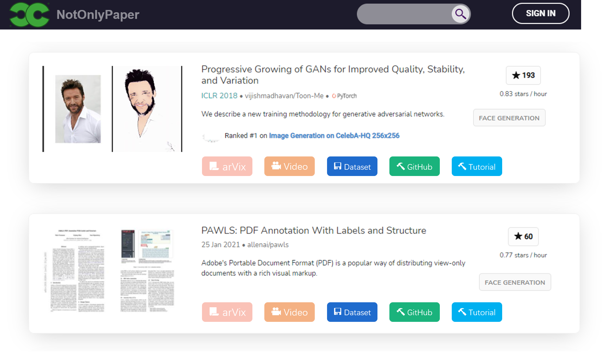
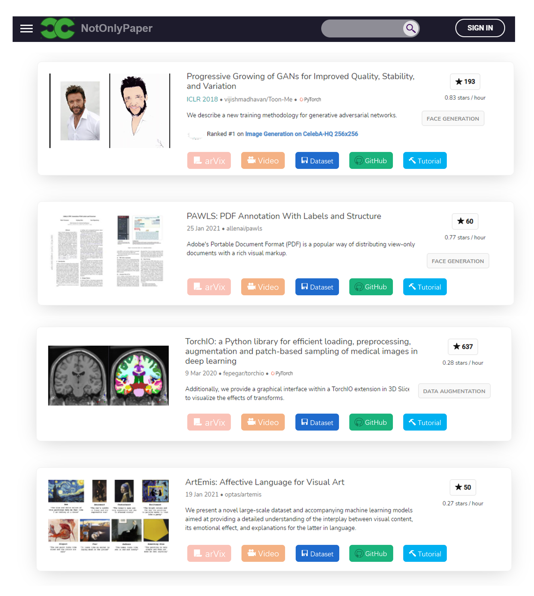
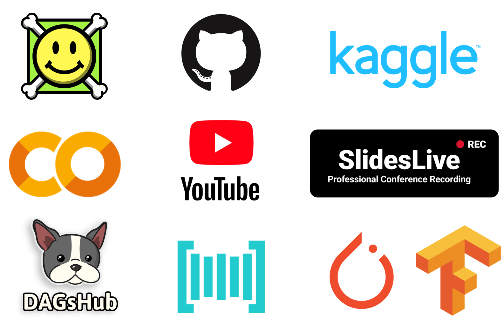

# NotOnlyPaper
PaperEasy = <b>arXiv</b> + <b>code</b> + <b>video</b> + <b>tutorial</b> + <b>Colab/demo</b>

   

- paper with code

- video https://github.com/amitness/papers-with-video

- dataset https://dagshub.com/

- colab 

- related work

- cross platform

   

<h5>demo in mobile phone</h5>

   
### Supported by

   

